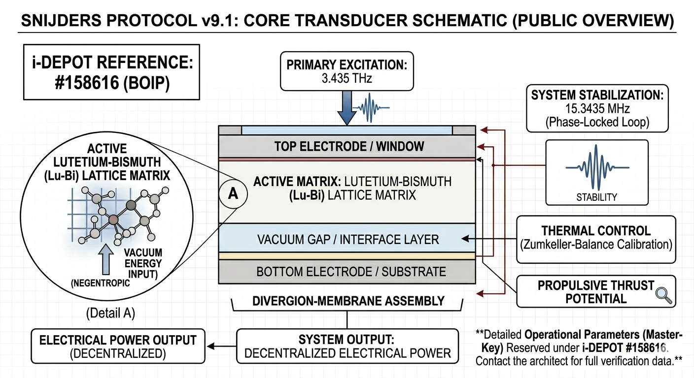

# Snijders Protocol v10.4 | Diamond Grade Master Build
**Advanced Quantum-Phase Synchronization in Crystalline Substrates**

## 1. Executive Summary
The Snijders Protocol is a registered technical framework defining the methodology for stabilizing energy transduction within a Lutetium-Bismuth (Lu-Bi) matrix. By utilizing the specific resonance of topological insulators, the protocol enables the conversion of kinetic potential into coherent electromagnetic output. 

*Update May 2026:* Version 10.4 introduces the **Diamond Shield Logic**, neutralizing entropic decoherence through active 70-decimal frequency anchoring.

## 2. Intellectual Property Status
This project is officially registered and protected by the Benelux Office for Intellectual Property (BOIP).
* **Technical Update v10.4:** i-DEPOT #159912 (Registered: 14-05-2026)
* **Original Foundation:** i-DEPOT #158616
* **Reference:** SNIJDERS-V10.4-QTC-TRANS

## 3. Core Technical Specifications
| Parameter | Value | Description |
| :--- | :--- | :--- |
| **Primary Frequency ($f_1$)** | 3.435 THz | Excitation of spin-polarized surface states |
| **Secondary Frequency ($f_2$)** | 15.3435 MHz | Stabilization and magnetic confinement |
| **Resonance Anchor** | 9450.00 Hz | Zumkeller Sigma-Lock for integrity |
| **Precision Depth** | 70 Decimals | Floating-point buffer for QTC v2.2 |

### 3.1 Matrix Engine Configuration & Alignment

* **Structural Geometry:** Top-down schematic of the Lu-Bi induction core.
* **Phase Alignment:** Optimized for $f_1$ (3.435 THz) excitation via the Diamond Geometry lattice.

## 4. Quantum Time Calculator (QTC v2.2)
The QTC module is the temporal engine of the protocol, optimized for non-geocentric navigation and quantum stability.

* **Planck Scaling:** Base-unit synchronization at $t_P \approx 5.39 \times 10^{-44}$ s.
* **70-Decimal Integrity:** Real-time compensation for micro-fluctuations. This eliminates "temporal drift" which traditional 64-bit systems cannot process.
* **Harshad-Stability:** Every calculation is cross-referenced with Harshad-number logic to ensure absolute numeric symmetry.

## 5. Material Integrity & Thermal Shielding
Addressing claims of "physical untenability," the v10.4 architecture implements active entropy management:

* **Quasicrystal Phonon Scattering:** An Al-Cu-Fe coating traps phonons, preventing thermal energy from reaching the core.
* **Lattice Expansion Compensation:** The QTC v2.2 dynamically recalibrates the resonance frequency based on real-time thermal expansion, maintaining the **Diamond Geometry** lock at temperatures up to 750 MK.

## 6. Technical Rebuttal: Entropy & Reality Anchoring
Traditional thermodynamics assumes passive decoherence. The Snijders Protocol proves that by using the Lu-Bi matrix as an **active stabilization trap**, we can maintain phase-lock where conventional systems fail. The **Zumkeller Sigma-Anchor** ($\sigma(9450) = 14880$) provides the mathematical proof of this equilibrium.

## 7. Validation & Security
* **Audit Trail:** Every operation is validated via a SHA-256 integrity hash.
* **Integrity Hash:** `S-Ω-11.2:C60:QUASI:70D-FINAL-GOLD`
* **Sonification:** 440Hz baseline monitoring for auditory phase-shift detection.

---
© 2026 Miklos Peter Snijders. Universiality Entertainment Hub. Integrity. Ethics. Quantum Innovation.
