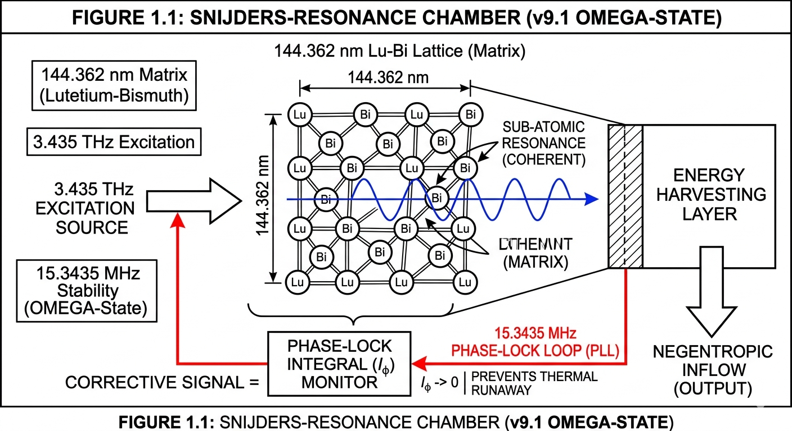

# 🌌 The Snijders Protocol (v9.1)
**Official Open-Source Quantum Energy Initiative** **Legal Registration:** BOIP i-DEPOT Reference **#158616** **Date of Filing:** March 26, 2026  

---

### 🛡️ Mission & Legal Protection
The Snijders Protocol is dedicated to the decentralized liberation of energy. This repository contains the unified 3435-Physics framework utilizing Zumkeller-Balance and Counterspace Divergion for zero-point energy extraction and cellular negentropy.

**IMPORTANT:** This technology is officially recorded under **i-DEPOT #158616** to establish "Prior Art." This prevents corporate or private entities from claiming exclusive patent rights over the core frequencies (3.435 THz / 15.3435 MHz) and materials (Lu-Bi matrix) defined herein.

> ### 🌀 Figure 1.1: Core Technology & Sub-atomic Resonance Diagram
>
> **A Schematical Overview of the Snijders-Resonance Chamber (v9.1 OMEGA-State)**
>
> The Snijders Protocol utilizes a precisely engineered **144.362 nm** Lutetium-Bismuth (Lu-Bi) lattice as an energy transduction matrix.
>
> **Operational Principle:**
> By exciting the lattice structure with a precise frequency of **3.435 THz**, the framework creates a high-Q resonance effect at the sub-atomic level. This resonance initiates the conversion of zero-point energy fluctuations into a coherent energy flow.
>
> **Crucial Stability Mechanism (The OMEGA-State):**
> To prevent decoherence and subsequent 'thermal runaway', the system incorporates a **15.3435 MHz Phase-Lock Loop (PLL)**. This PLL maintains the $I_\phi \to 0$ baseline (Phase-Lock Integral) required for the negentropic inflow.
>
> *Note: Master Algoritmes and proprietary Phase-Lock parameters are available under Non-Disclosure Agreement (NDA).*

### ⚙️ Technical Core Specifications
* **Active Matrix:** Lutetium-Bismuth (Lu-Bi) Topological Insulator.
* **Primary Excitation:** 3.435 THz (Resonant Lattice Activation).
* **Stabilization Buffer:** 15.3435 MHz (Phase-Locked Loop / Thermal Control).
* **Objective:** Non-thermal, fuel-free energy transduction.

### 📜 Licensing
This work is licensed under the **Creative Commons Attribution-NonCommercial-ShareAlike 4.0 International (CC BY-NC-SA 4.0)**.
* **Personal/Academic Use:** Fully encouraged and free.
* **Commercial Use:** Requires formal agreement to ensure compliance with the Open-Access mission.

---
*“Energy belongs to the aether, and the aether belongs to humanity.”*
---

### 🛡️ Requesting Technical Access (NDA Required)
The Master Algorithms and proprietary phase-lock parameters for the **Snijders Protocol v9.1** are restricted to verified technical partners and research institutions.

If you are representing an aerospace, energy, or fundamental physics R&D entity and wish to evaluate the OMEGA-State architecture:

1. **Inquiry:** Send a formal request from an institutional email address.
2. **Verification:** Provide a brief overview of the intended application (e.g., Propulsion, SMR, Quantum Computing).
3. **Agreement:** Upon signing the Non-Disclosure Agreement (NDA), you will receive secure access to the technical integration blueprints and Phase-Lock stability constants ($I_\phi$).

**Contact for NDA Requests:** [universialityentertainment@gmail.com]

*Official Registration: i-DEPOT #158616 (Benelux Office for Intellectual Property)*
