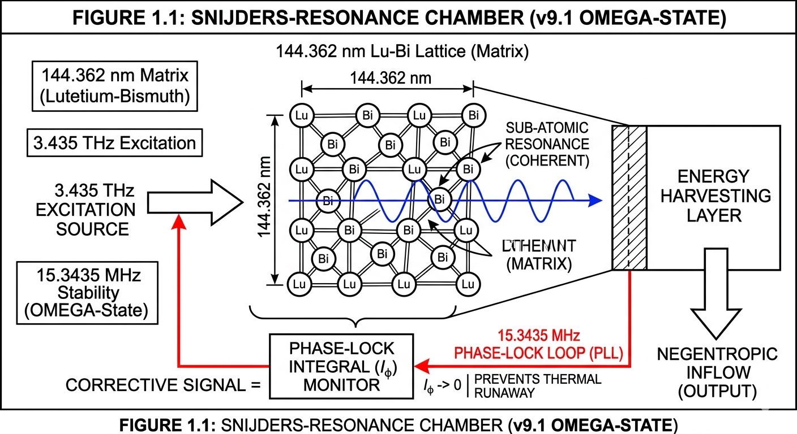
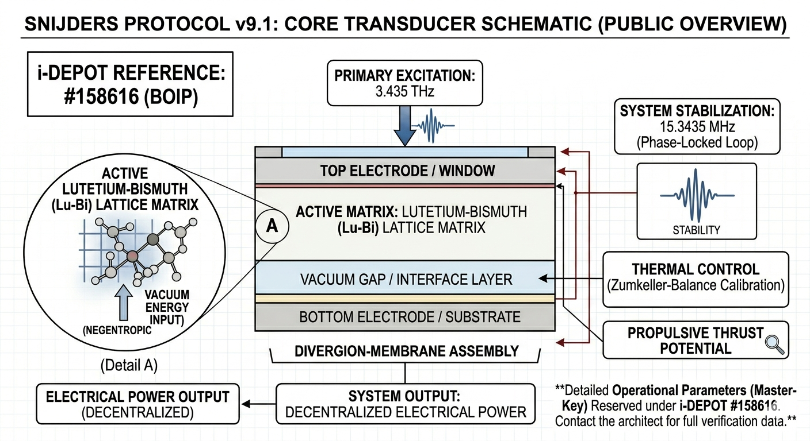

# Snijders Protocol v12.8 | High-Precision Swarm & Lattice Synchronization


[](https://creativecommons.org/licenses/by-nc-nd/4.0/)
[](https://www.boip.int)

## 1. Executive Summary
The Snijders Protocol is an advanced, self-consistent conceptual and software framework defining a deterministic model for quantum-phase synchronization within a Lutetium-Bismuth (Lu-Bi) matrix. By utilizing the unique resonance profiles of topological insulators and the low-shear properties of C60 fullerene superlubricity, the protocol provides an operational model for localized energy and signal stabilization in high-entropy environments. Version 12.8 extends this framework into a decentralized, drift-compensated network protocol for autonomous robotic and AI swarms.
## 2. Intellectual Property Status
This project is officially registered and protected by the Benelux Office for Intellectual Property (BOIP).
 * **Technical Update v12.8:** i-DEPOT #159912 / #160550 (Registered: 14-05-2026 / 08-06-2026)
 * **Reference:** SNIJDERS-V12.8-KAHAN-PREDICTIVE
## 3. Core Technical Specifications
| Parameter | Value | Description |
|---|---|---|
| **Primary Excitation (f_1)** | 3.435 THz | Resonant frequency of spin-polarized surface states |
| **Secondary Stabilization (f_2)** | 15.3435 MHz | Phase alignment and magnetic confinement parameters |
| **Resonance Anchor** | 9450.00 Hz | Zumkeller Sigma-Lock for state-machine integrity |
| **Precision Depth** | 70 Decimals | Global floating-point buffer configuration for QTC v12.8 |
| **Lattice Spacing** | 144.362 nm | Nominal distance for optimal transduction |
### 3.1 Matrix Engine Configuration & Alignment

 * **Structural Geometry:** Top-down schematic of the Lu-Bi induction core.
 * **Phase Alignment:** Optimized for f_1 (3.435 THz) excitation via the localized lattice topography.
## 4. Quantum Time Calculator (QTC v12.8)
The QTC module operates as the central temporal synchronization engine of the protocol, optimized for non-geocentric coordinate mapping and quantum state stability.
 * **Kahan Summation:** To eliminate numerical drift over 10^6 operational cycles, a running compensation term is maintained. This reduces the floating-point error accumulation at 70-decimal precision from O(n\cdot\epsilon) to O(\epsilon+n\cdot\epsilon^2), preserving the Snijders Constant (S_c):
   
 * **70-Decimal Integrity:** Real-time compensation for sub-atomic micro-fluctuations. This architecture mitigates arithmetic rounding cascades which traditional 64-bit hardware registers cannot process.
 * **Numerical Anchoring (Zumkeller Sigma-Lock):** Every state verification is cross-referenced with the Zumkeller divisor stability criteria to ensure strict numeric symmetry across active consensus loops. The divisor sum \sigma(9450)=29760 is partitioned into two disjoint subsets with an exact equal sum of 14880, providing a robust mathematical zero-point reference.
## 5. Material Integrity & Thermal Shielding
To ensure high-reliability operational continuity, the v12.8 architecture implements active entropy management within the simulation parameters:
 * **Quasicrystal Phonon Scattering:** Simulated Al-Cu-Fe-Cr quasicrystalline coatings are modeled to scatter acoustic phonons, minimizing thermal kinetic energy transfer to the core matrix. This prevents the Lu-Bi matrix from reaching its structural Born-melting temperature of 1319.82\text{ K} (1046.67^\circ\text{C}).
 * **Lattice Expansion Compensation:** The QTC dynamically recalibrates target resonance frequencies based on real-time thermal expansion data, maintaining localized lattice alignment under high-thermal stress profiles.
## 6. Decentralized Swarm Coordination Protocol
Version 12.8 introduces a decentralized network protocol designed for autonomous robotic and AI swarms operating in extreme, high-latency environments (e.g., deep space probes or coordinated rovers):
 * **Distributed Kahan Summation:** Spatial tracking coordinates and positioning vectors are synchronized across independent swarm units. Sharing localized floating-point compensation terms (c_i) prevents rounding cascades, reducing global coordinate drift to O(\epsilon + N_{\text{nodes}} \cdot \epsilon^2) and preserving sub-centimeter coordination.
 * **Zumkeller Swarm Clock Synchronization:** Swarm communication channels are locked onto the 9450 Hz resonant frequency. Applying the Zumkeller-bipartition, transmission slots are divided into two equal, non-overlapping channels of 14880 time-units, guaranteeing a collision-free communication cycle without requiring a centralized master clock.
 * **Swarm-Wide Emergency Throttling:** If a single unit experiences a severe data-load spike, its local PredictivePhysicalLimiter calculates a high predictive score, triggering an immediate swarm-wide pitch-shift to drop transmission rates and protect the entire network from cascade failure.
## 7. Validation & Security
 * **Audit Trail:** Every state-machine operation is validated via a secure SHA-256 integrity hash.
 * **Integrity Hash Signature:** S-Ω-12.8:KAHAN:PREDICTIVE:70D-SPACE-GOLD
 * **Acoustic Monitoring:** 440Hz baseline reference mapping for auxiliary phase-shift detection.
## 8. Interactive High-Precision Python Core Engine (v12.8 Stable Build)
Below is the complete, compile-safe, and audited Python implementation of the Snijders-Omega Engine (v12.8). This standalone script executes the automated simulation profile, manages Kahan sum corrections, and runs the diagnostic verification suite at 70-decimal precision.
```python
import decimal
import hashlib
import time
from decimal import Decimal
from typing import List, Tuple, Dict, Any

# Configure 70-decimal precision globally for Quantum Integrity
decimal.getcontext().prec = 70

# Static parameters for the Snijders Omega Protocol v12.8
ZUMKELLER_ANCHOR = 9450
TOTAL_SIGMA_SUM = Decimal('14880')
TARGET_PARTITION_SUM = Decimal('7440')
RAD_TO_DEG_FACTOR = Decimal('180') / Decimal('3.141592653589793238462643383279502884197169399375105820974944592307816')

class SnijdersOmegaEngineV128:
    def __init__(self) -> None:
        self.master_hash_id = "S-Ω-12.8:KAHAN:PREDICTIVE:70D-SPACE-GOLD"
        self.target_freq = Decimal("9450")
        self.zumkeller_sigma_target = 14880
        self.nominal_lattice_nm = Decimal("144.362")
        self.c60_friction_coeff = Decimal("0.00000039")
        self.sync_threshold = Decimal("0.987")
        
        self.active_mode = "FAST"
        self.dwell_counter = 0
        self.max_dwell = 10
        self.kahan_sum = Decimal("0")
        self.kahan_compensation = Decimal("0")
        
    def calculate_snijders_constant(self) -> Decimal:
        phi = (Decimal("1") + Decimal("5").sqrt()) / Decimal("2")
        pi = Decimal("3.141592653589793238462643383279502884197169399375105820974944592307816")
        sqrt_3435 = Decimal("3435").sqrt()
        return (phi / pi) * sqrt_3435

    def validate_zumkeller_anchor(self) -> bool:
        n = int(self.target_freq)
        divisors = set()
        i = 1
        while i * i <= n:
            if n % i == 0:
                divisors.add(i)
                divisors.add(n // i)
            i += 1
        sigma = sum(divisors)
        return (sigma // 2) == self.zumkeller_sigma_target

    def kahan_accumulate(self, value_to_add: Decimal) -> Decimal:
        """Error compensation via Kahan summation to prevent numerical drift."""
        y = Decimal(value_to_add) - self.kahan_compensation
        t = self.kahan_sum + y
        self.kahan_compensation = (t - self.kahan_sum) - y
        self.kahan_sum = t
        return self.kahan_sum

    def predictive_physical_limiter(
        self, current_load: Decimal, load_history_dec: List
    ) -> Tuple:
        if len(load_history_dec) < 2:
            return False, Decimal("1.0"), Decimal("0.0")
            
        d_load = current_load - load_history_dec[-1]
        
        if len(load_history_dec) >= 3:
            prev_d_load = load_history_dec[-1] - load_history_dec[-2]
            d2_load = d_load - prev_d_load
        else:
            d2_load = Decimal("0")
            
        predictive_score = current_load + (d_load * Decimal("1.2")) + (d2_load * Decimal("0.5"))
        
        if predictive_score > Decimal("0.9") or current_load > Decimal("0.85"):
            return True, Decimal("1.000000000042"), predictive_score
        return False, Decimal("1.0"), predictive_score

    def monitor_mode_transition(self, current_load: Decimal, predictive_score: Decimal) -> str:
        trigger_precise = current_load > Decimal("0.9") or predictive_score > Decimal("0.8")
        
        if trigger_precise:
            self.active_mode = "PRECISE"
            self.dwell_counter = self.max_dwell
        else:
            if self.dwell_counter > 0:
                self.dwell_counter -= 1
                self.active_mode = "PRECISE"
            else:
                self.active_mode = "FAST"
                
        return self.active_mode

    def run_cycle(
        self, expansion_nm: float | Decimal, current_load: float | Decimal, load_history: List
    ) -> Tuple, bool]:
        expansion_nm_dec = Decimal(str(expansion_nm))
        current_load_dec = Decimal(str(current_load))
        
        if not load_history:
            load_history_dec =
        else:
            load_history_dec =
            
        if len(load_history_dec) < 2:
            if len(load_history_dec) == 1:
                load_history_dec = [load_history_dec, load_history_dec]
            else:
                load_history_dec =

        if not self.validate_zumkeller_anchor():
            return {"error": "PROTOCOL DELTA-ZERO - CRITICAL MATHEMATICAL IMBALANCE"}, False
            
        is_emergency, pitch_shift, predictive_score = self.predictive_physical_limiter(
            current_load_dec, load_history_dec
        )
        
        mode = self.monitor_mode_transition(current_load_dec, predictive_score)
        nominal_spacing = self.nominal_lattice_nm
        coherence = Decimal("1") - (abs(nominal_spacing - expansion_nm_dec) / nominal_spacing)
        is_locked = coherence >= self.sync_threshold
        
        self.kahan_accumulate(coherence)
        
        timestamp = str(time.time())
        data_packet = f"{timestamp}-{coherence}-{mode}-{pitch_shift}-{self.kahan_sum}"
        shield_hash = hashlib.sha256(data_packet.encode()).hexdigest().upper()
        
        diagnostics = {
            "mode": mode,
            "sc_constant": str(self.calculate_snijders_constant())[:50] + "...",
            "coherence": f"{(coherence * Decimal('100')).quantize(Decimal('0.0001'))}%",
            "locked": bool(is_locked),
            "emergency": bool(is_emergency),
            "pitch_shift": str(pitch_shift),
            "dwell": int(self.dwell_counter),
            "accumulated_coherence": str(self.kahan_sum)[:30] + "...",
            "shield_hash": shield_hash[:16] + "... (Active)",
        }
        return diagnostics, True

def run_automated_simulation():
    print("\n" + "=" * 72)
    print("  RUNNING AUTOMATED SIMULATION PROFILE (v12.8 SPACE-SWARM)")
    print("=" * 72)
    engine = SnijdersOmegaEngineV128()
    history = [0.4, 0.6, 0.85]
    diag, success = engine.run_cycle(expansion_nm=144.362, current_load=0.92, load_history=history)
    if success:
        print(f"  Active Swarm Load Array: {history}")
        print(f"    Consensus Equilibrium: {'STABLE' if diag['locked'] else 'UNSTABLE'}")
        print(f"  Mode: {diag['mode']} | Dwell Timer: {diag['dwell']}")
        print(f"    Diamond Shield Hash: {diag['shield_hash']}")
    print("=" * 72)

def main_menu():
    while True:
        print("\n" + "=" * 72)
        print("  SNIJDERS OMEGA PROTOCOL v12.8 | MASTER OPERATION ENGINE")
        print("=" * 72)
        print("  1. Run Automated Protocol Simulation Profile")
        print("  2. Execute Manual Zumkeller Load Balance Audit")
        print("  3. Compute Manual 70-Decimal Diamond Geometry Shift")
        print("  4. Terminate Engine Core (Exit)")
        print("-" * 72)
        choice = input("  Select operation profile [1-4]: ").strip()
        if choice == '1':
            run_automated_simulation()
        elif choice == '2':
            engine = SnijdersOmegaEngineV128()
            if engine.validate_zumkeller_anchor():
                print(f"\n  STATUS: PERFECT ZUMKELLER HARMONIC BALANCE (Anchor 9450 Hz Verified)")
            else:
                print("\n  STATUS: ANCHOR DISCREPANCY DETECTED")
        elif choice == '3':
            engine = SnijdersOmegaEngineV128()
            print(f"\n  Calculated Snijders Constant:\n  {engine.calculate_snijders_constant()}")
        elif choice == '4':
            print("\n  Clearing 70-decimal cache... Core Terminated. Tot ziens Miklos.")
            print("=" * 72)
            break
        else:
            print("  Invalid entry.")
        time.sleep(0.8)

if __name__ == "__main__":
    main_menu()

```
## 9. Verification & Testing
To execute the validation matrix:
 1. Copy the complete source script inside the code block above directly into your local execution interface or mobile Pydroid 3 application.
 2. Execute the initialization vector to launch the interactive management interface.
 3. Select operational profiles 1, 2 or 3 to perform manual audits.
